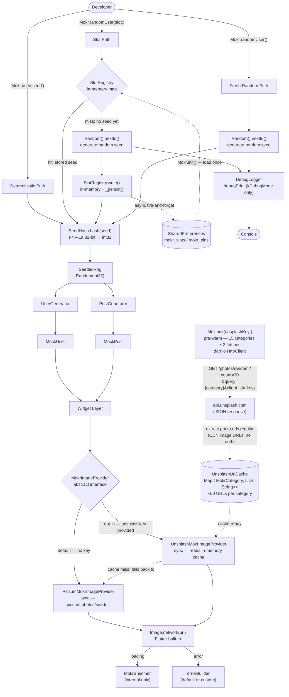

# mokr — Architecture

**Version:** 0.1.0  
**Date:** 2026-04-03  
**Status:** Design — pre-implementation

This document is the engineering source of truth for the mokr package. Every implementation
decision maps to a section here. When in doubt about any design question, this file wins.

---

## 1. System Diagram



**Read the diagram left-to-right, top-to-bottom:**

1. Developer makes one call.
2. Path splits based on mode (deterministic / slot / fresh).
3. All three paths converge at `SeedHash` → `SeededRng`.
4. `SeededRng` drives a generator, which produces a model.
5. Widgets consume models and delegate image URLs to `MokrImageProvider`.
6. `SlotRegistry` reads from `SharedPreferences` once at `init()`; all subsequent slot
   reads are in-memory (synchronous). Writes are async and fire-and-forget.

---

## 2. The Seed Pipeline

### Mode 1 — Deterministic: `Mokr.user('seed')`

```
Call:    Mokr.user('user_42')
Check:   nothing — seed is caller-provided
Write:   nothing — no disk, no map
Return:  UserGenerator.generate(SeededRng(SeedHash.hash('user_42')))
Log:     none
```

The seed string is the single input. `SeedHash.hash` converts it to a stable `int32`.
`SeededRng` wraps `dart:math Random(seed)`. `UserGenerator` consumes values in the
documented order (Section 5) and returns an immutable `MockUser`.

This mode has zero runtime dependencies beyond the hash computation. No `Mokr.init()`
is required for this path to work, but calling `init()` is still the contract for safety.

---

### Mode 2 — Stable Random (Slot): `Mokr.randomUser(slot: 'x')`

```
Call:    Mokr.randomUser(slot: 'card_1')
Check:   SlotRegistry._map.containsKey('card_1')

  [HIT — slot already seeded]
    Return: UserGenerator.generate(SeededRng(SeedHash.hash(_map['card_1']!)))
    Log:    [mokr] 📌 slot:'card_1' → seed: 'mokr_f2Dc' (from disk)

  [MISS — first call for this slot]
    Generate: seed = _generateRandomSeed()   // e.g. 'mokr_a7Be'
    Write:    _map['card_1'] = 'mokr_a7Be'
    Persist:  _persist()  // async, fire-and-forget
    Return:   UserGenerator.generate(SeededRng(SeedHash.hash('mokr_a7Be')))
    Log:      [mokr] 🎲 fresh → seed: 'mokr_a7Be'  (randomUser, slot:'card_1')
```

Once written, the slot is stable across hot reload, hot restart, and app reinstall
(as long as the device's SharedPreferences data is not cleared).

---

### Mode 3 — Pinned Slot: `Mokr.randomUser(slot: 'x', pin: true)`

```
Call:    Mokr.randomUser(slot: 'card_1', pin: true)
Check:   SlotRegistry._map.containsKey('card_1')

  [HIT]
    Ensure: _pins.add('card_1') (idempotent)
    Persist if newly pinned.
    Return: UserGenerator.generate(SeededRng(SeedHash.hash(_map['card_1']!)))
    Log:    [mokr] 🔒 pin:'card_1' → seed: 'mokr_f2Dc' (protected)

  [MISS]
    Same as Mode 2 MISS, then also add 'card_1' to _pins.
    Log:    [mokr] 🎲 fresh → seed: 'mokr_a7Be'  (randomUser, slot:'card_1', pinned)
```

The only behavioural difference from Mode 2 is that `clearAll()` skips pinned slots.

---

### Mode 4 — Fresh Random: `Mokr.randomUser()`

```
Call:    Mokr.randomUser()
Check:   nothing
Write:   nothing
Generate: seed = _generateRandomSeed()   // e.g. 'mokr_x9Qp'
Return:  UserGenerator.generate(SeededRng(SeedHash.hash('mokr_x9Qp')))
Log:     [mokr] 🎲 fresh → seed: 'mokr_x9Qp'  (randomUser)
```

A fresh, unanchored seed on every call. The console log is the developer's hook to
graduate this to Mode 1 or 2 if they like the result.

### Seed Format

Generated seeds always use the `mokr_` prefix followed by 4 alphanumeric characters:

```
mokr_[A-Za-z0-9]{4}
```

Examples: `mokr_a7Be`, `mokr_f2Dc`, `mokr_x9Qp`

Generation:
```dart
String _generateRandomSeed() {
  const chars = 'abcdefghijklmnopqrstuvwxyzABCDEFGHIJKLMNOPQRSTUVWXYZ0123456789';
  final rng = Random();
  return 'mokr_' + List.generate(4, (_) => chars[rng.nextInt(chars.length)]).join();
}
```

This gives 62^4 = 14,776,336 possible seeds — sufficient for any UI prototype.
`Random()` (non-seeded) is used here intentionally — this is the only place in the
codebase where non-deterministic randomness is acceptable.

---

## 3. SlotRegistry Design

### In-Memory State

```dart
class SlotRegistry {
  // slot name → seed string
  final Map<String, String> _map = {};
  // slot names that are pinned (survive clearAll)
  final Set<String> _pins = {};
}
```

### SharedPreferences Keys

| Key | Type | Format |
|---|---|---|
| `mokr_slots` | String | JSON object: `{"card_1":"mokr_a7Be","hero":"mokr_f2Dc"}` |
| `mokr_pins` | String | JSON array: `["hero"]` |

Both keys are written atomically on every change. Read once at `Mokr.init()`.

```dart
Future<void> _persist() async {
  final prefs = await SharedPreferences.getInstance();
  await prefs.setString('mokr_slots', jsonEncode(_map));
  await prefs.setString('mokr_pins', jsonEncode(_pins.toList()));
}
```

`_persist()` is always called as `unawaited(_persist())`. The in-memory state is
authoritative. Disk is a cache. No read-after-write is needed.

### Initialisation Protocol

```dart
static Future<void> load() async {
  final prefs = await SharedPreferences.getInstance();
  final slotsJson = prefs.getString('mokr_slots');
  final pinsJson  = prefs.getString('mokr_pins');

  if (slotsJson != null) {
    _map.addAll(Map<String, String>.from(jsonDecode(slotsJson)));
  }
  if (pinsJson != null) {
    _pins.addAll(List<String>.from(jsonDecode(pinsJson)));
  }
}
```

### Thread Safety

Dart runs all Flutter UI work on a single isolate. `build()` methods — the only
callers of `SlotRegistry.resolve()` — execute synchronously on the main isolate.

`resolve()` itself is fully synchronous: it reads from `_map` (in-memory) and writes
to `_map` (in-memory). The async `_persist()` call is fire-and-forget — it does not
block `resolve()` or create a read-modify-write race.

**Conclusion: no concurrent access is possible. SlotRegistry does not need a lock.**

### `init()` Not Called — Fail Loudly

```dart
static bool _initialised = false;

static Future<void> init({MokrImageProvider? imageProvider}) async {
  assert(
    !kReleaseMode,
    'mokr must not be used in production. Remove Mokr.init() before releasing.',
  );
  await SlotRegistry.load();
  _imageProvider = imageProvider ?? UnsplashMokrImageProvider();
  _initialised = true;
}

// Every public method:
static MockUser user(String seed) {
  assert(_initialised, 'Call await Mokr.init() in main() before using mokr.');
  // ...
}
```

Calling any data method before `init()` throws an `AssertionError` in debug mode
with a clear message. In release mode, the first `assert(!kReleaseMode)` in `init()`
has already halted execution — so the un-initialised path is unreachable.

---

## 4. Hash Function Decision

### Candidates

| Property | FNV-1a 32-bit | djb2 |
|---|---|---|
| Avalanche | Excellent — ~50% bit flip per input bit | Weak — neighbouring inputs cluster |
| Speed | Fast — one XOR + one multiply per byte | Very fast — shift + add per char |
| Dart impl | 3 lines, no imports | 2 lines, no imports |
| Known weaknesses | None for non-crypto use | Clustering on strings with shared prefixes |
| Zero-sensitivity | Distinguishes empty string vs `'\0'` | Same weakness as FNV-1 (not FNV-1a) |

### Decision: FNV-1a 32-bit

**Justification:**

djb2's primary weakness is relevant to mokr. Seed strings like `'card_0'`, `'card_1'`,
`'card_2'` share a long common prefix. djb2's `hash * 33 + char` step produces
adjacent hash values for these inputs — and adjacent hash values seed `Random()` with
adjacent integers, producing statistically similar data (similar names, similar follow
counts). This would be visible in a UI list and is unacceptable.

FNV-1a XORs each byte into the accumulator *before* multiplying, so every byte
contributes to the avalanche regardless of its position. `'card_0'` and `'card_1'`
will produce hash values with ~50% differing bits — uncorrelated data.

**Implementation (pure Dart, no imports required):**

```dart
/// FNV-1a 32-bit hash. Pure Dart. No FFI.
/// Stable: do not change algorithm without a major version bump.
static int hash(String input) {
  var h = 0x811c9dc5; // FNV-1a offset basis
  for (final byte in input.codeUnits) {
    h ^= byte;
    h = (h * 0x01000193) & 0xFFFFFFFF; // FNV-1a prime, masked to 32 bits
  }
  return h;
}
```

The `& 0xFFFFFFFF` mask is required because Dart uses 64-bit integers; without it
the multiplication overflows into the upper 32 bits and the result differs from the
spec. `dart:math`'s `Random(seed)` accepts `int`, so the 32-bit result is passed
directly.

### Collision Rate Test Plan

Generate 10,000 keys `'key_0000'` through `'key_9999'`. Compute `SeedHash.hash(key)`
for each. Assert no two keys produce the same hash value.

**Expected result:** zero collisions.

By the birthday paradox, the expected number of collisions for 10,000 keys in a
2^32 ≈ 4.3 billion space is:

```
E[collisions] = k² / (2 × N) = (10,000)² / (2 × 4,294,967,296) ≈ 0.012
```

This is statistically negligible. The test is a regression guard, not a stress test.

The `sig` mapping (`hash % 9999`) deliberately produces duplicates — that's correct.
A `sig` in 0–9999 selects from Unsplash's result set, and many seeds can share a
`sig` without issue (they still resolve to different photos via Unsplash's matching).

---

## 5. RNG Consumption Order

**This is a semver-stability contract.** Once v1.0.0 is published, this order cannot
change without a major version bump. Any change will produce different data for
existing seeds.

### MockUser — Exact Consumption Order

The `SeededRng` for a given seed consumes values in this exact sequence:

```
Draw 1:   firstNameIndex  = rng.nextInt(firstNames.length)
Draw 2:   lastNameIndex   = rng.nextInt(lastNames.length)
Draw 3:   bioLength       = 1 + rng.nextInt(3)       → 1, 2, or 3
Draw 4:   bioPhrase[0]    = rng.nextInt(bioPhrases.length)   ← always consumed
Draw 5:   bioPhrase[1]    = rng.nextInt(bioPhrases.length)   ← always consumed
Draw 6:   bioPhrase[2]    = rng.nextInt(bioPhrases.length)   ← always consumed
           bio = bioPhrases[0..bioLength-1].join(' ')
           (draws 4–6 are always made; only the first `bioLength` are used)
Draw 7:   followerTier    = rng.nextDouble()          → selects tier
Draw 8:   followerValue   = rng.nextInt(tierMax)      → value within tier
Draw 9:   followingCount  = rng.nextInt(5000)
Draw 10:  postCount       = rng.nextInt(1000)
Draw 11:  isVerifiedRaw   = rng.nextDouble()          → < 0.04 = verified
Draw 12:  joinedAtRaw     = rng.nextDouble()          → days-ago via exp dist
```

**Key invariant:** bio phrase draws 4–6 are always consumed, even when `bioLength < 3`.
This decouples all downstream positions from the bio length value, making the
consumption order fully fixed at 12 draws regardless of output.

Derived fields (not from RNG):
- `seed` — the input string, stored as-is
- `id` — `'usr_${SeedHash.hash(seed).toRadixString(16).padLeft(8, '0').substring(0, 4)}'`
- `name` — `'${firstNames[draw1]} ${lastNames[draw2]}'`
- `username` — `'@${name.toLowerCase().replaceAll(' ', '.')}'`
- `avatarUrl` — `Mokr.avatarUrl(seed)` (sync, no RNG)

`String.hashCode` is explicitly banned for `id` derivation — it is not stable across
Dart VM restarts. `SeedHash.hash` (FNV-1a 32-bit) is stable, pure, and fast.

### MockPost — Exact Consumption Order

The post's `author` is derived by a separate seed string — it does **not** consume
from the post's `SeededRng`. Author seed derivation:

```dart
final authorSeed = '${postSeed}_author';
final author = UserGenerator.generate(SeededRng(SeedHash.hash(authorSeed)));
```

This approach ensures author and post data are independent; changing one does not
shift the other's RNG draws.

The post `SeededRng` consumes:

```
Draw 1:   captionLength   = 1 + rng.nextInt(4)       → 1, 2, 3, or 4 phrases
Draw 2:   captionPhrase[0] = rng.nextInt(captionPhrases.length)  ← always consumed
Draw 3:   captionPhrase[1] = rng.nextInt(captionPhrases.length)  ← always consumed
Draw 4:   captionPhrase[2] = rng.nextInt(captionPhrases.length)  ← always consumed
Draw 5:   captionPhrase[3] = rng.nextInt(captionPhrases.length)  ← always consumed
           caption = captionPhrases[0..captionLength-1].join(' ')
Draw 6:   hasImageRaw      = rng.nextDouble()         → < 0.80 = has image
Draw 7:   imageCategoryIdx = rng.nextInt(MokrCategory.values.length)
Draw 8:   likeU1           = rng.nextDouble()         → triangle dist, draw 1
Draw 9:   likeU2           = rng.nextDouble()         → triangle dist, draw 2
Draw 10:  commentCount     = rng.nextInt(500)
Draw 11:  shareCount       = rng.nextInt(200)
Draw 12:  isLikedRaw       = rng.nextDouble()         → < 0.30 = liked
Draw 13:  createdAtRaw     = rng.nextDouble()         → days-ago via exp dist
Draw 14:  tagCount         = rng.nextInt(6)           → 0–5
Draw 15:  tagIndex[0]      = rng.nextInt(hashtags.length)  ← always consumed
Draw 16:  tagIndex[1]      = rng.nextInt(hashtags.length)  ← always consumed
Draw 17:  tagIndex[2]      = rng.nextInt(hashtags.length)  ← always consumed
Draw 18:  tagIndex[3]      = rng.nextInt(hashtags.length)  ← always consumed
Draw 19:  tagIndex[4]      = rng.nextInt(hashtags.length)  ← always consumed
           tags = hashtags[0..tagCount-1]
```

Total draws: exactly 19, always. Same fixed-consumption strategy as MockUser.

`imageUrl` is `null` when `hasImageRaw >= 0.80`. `imageCategoryIdx` draw 7 is always
consumed regardless — category is chosen even for text-only posts, it is simply not
stored.

MockPost derived fields (not from RNG):
- `seed` — the input string, stored as-is
- `id` — `'pst_${SeedHash.hash(seed).toRadixString(16).padLeft(8, '0').substring(0, 4)}'`
- `author` — `UserGenerator.generate(SeededRng(SeedHash.hash('${seed}_author')))` (separate RNG)
- `imageUrl` — `Mokr.imageUrl(seed, category: imageCategory!)` when `hasImage`, else `null` (sync)

---

## 6. Data Generation Strategy

### Name Lists

| Table | Size | Scope |
|---|---|---|
| `first_names.dart` | 200 entries | Western European (50), Eastern European (30), East Asian (40), South Asian (25), Latin American (30), African (25) |
| `last_names.dart` | 200 entries | Same cultural distribution as first names |
| `bio_phrases.dart` | 100 entries | Short 5–10 word phrases: hobbies, roles, locations, personality traits |
| `caption_phrases.dart` | 80 entries | Casual social-media-style sentences |
| `hashtags.dart` | 100 entries | Common lifestyle/content hashtags without `#` |

**Unique name combinations:** 200 × 200 = **40,000**. Sufficient for any UI prototype.

All lists are plain `const List<String>` values in static Dart files — no assets,
no JSON, no network. Zero startup I/O beyond what `init()` does for SharedPreferences.

### Follower Count — Power-Law (Tier Approximation)

Social networks follow Zipf's law: most users have few followers, very few have
millions. Tier-based approximation (2 RNG draws: tier selector + intra-tier value):

```dart
int _generateFollowerCount(SeededRng rng) {
  final tier = rng.nextDouble();  // draw 7
  final val  = rng.nextDouble();  // draw 8 — repurposed as nextInt equivalent
  if (tier < 0.60) return (val * 1_000).toInt();          // 0–999
  if (tier < 0.85) return 1_000  + (val * 9_000).toInt(); // 1k–9.9k
  if (tier < 0.95) return 10_000 + (val * 90_000).toInt();// 10k–99.9k
  if (tier < 0.99) return 100_000 + (val * 900_000).toInt();// 100k–999k
  return 1_000_000 + (val * 49_000_000).toInt();           // 1M–50M
}
```

This produces the characteristic long-tail shape visible in real follower distributions.

### Recency-Weighted Timestamps — Exponential Distribution

Real social content is weighted toward the recent past. Exponential distribution via
inverse CDF transform:

```
daysAgo = (-ln(1 - u) × λ).round()
```

Where `u = rng.nextDouble()` and `λ` is the mean.

This splits into two distinct concerns: **generation** (must be deterministic) and
**display** (may use `DateTime.now()`).

**Generation — fixed reference date:**

```dart
// Fixed reference date — the deterministic "present" for all generators.
// Must never be DateTime.now(). Update only on a major version bump.
static final _reference = DateTime(2026, 1, 1);

DateTime _generateJoinedAt(SeededRng rng) {
  final u = rng.nextDouble();  // draw 12
  final daysAgo = (-log(1 - u.clamp(0, 0.9999)) * 365).round().clamp(0, 3650);
  return _reference.subtract(Duration(days: daysAgo));
}

DateTime _generateCreatedAt(SeededRng rng) {
  final u = rng.nextDouble();  // draw 13
  final daysAgo = (-log(1 - u.clamp(0, 0.9999)) * 14).round().clamp(0, 365);
  return _reference.subtract(Duration(days: daysAgo));
}
```

The `clamp(0, 0.9999)` prevents `log(0)` (negative infinity) when `u = 1.0`.

**Why `DateTime(2026, 1, 1)` not `DateTime.now()`:** `DateTime.now()` in data
generation is banned (see design-principles.md). The same seed must produce the same
`joinedAt` value on every device, every day, forever. The reference date is a
constant baked into the package.

**Display — `relativeTime` getter uses `DateTime.now()`:**

```dart
// In MockPost / MockUser — display formatting only:
String get relativeTime {
  final diff = DateTime.now().difference(createdAt);
  if (diff.inMinutes < 1)  return 'just now';
  if (diff.inMinutes < 60) return '${diff.inMinutes}m ago';
  if (diff.inHours   < 24) return '${diff.inHours}h ago';
  if (diff.inDays    < 30) return '${diff.inDays}d ago';
  return '${(diff.inDays / 30).floor()}mo ago';
}
```

This is correct: `createdAt` (the stored `DateTime`) is fully deterministic. Only
the human-readable *display* of its age changes over time, and that is expected
behaviour — the same post appearing "2h ago" today and "3d ago" in three days is
correct, not a bug. The determinism contract is on the data, not the display.

### Like Count — Triangle Distribution

Likes follow a unimodal distribution centred around a moderate value. Using the
average of two uniform draws (CLT approximation — triangle/tent distribution):

```dart
int _generateLikeCount(SeededRng rng) {
  final u = (rng.nextDouble() + rng.nextDouble()) / 2.0; // draws 8 + 9
  return (u * 10_000).round(); // 0–10k, peak at 5k
}
```

Two draws produce a symmetric triangle distribution. Visually realistic for a feed
with a mix of micro and viral posts.

---

## 7. Image Provider Architecture

### Provider Hierarchy

| Tier | Provider | Auth | Category filtering | Quality | Activation |
|---|---|---|---|---|---|
| 1 — Opt-in | `UnsplashMokrImageProvider` | Free API key | Real keyword search | High (curated photography) | `Mokr.init(unsplashKey: 'key')` |
| 2 — Default | `PicsumMokrImageProvider` | None | Seed-based variation only | Good (diverse stock) | `Mokr.init()` |

**Picsum is the zero-config default.** Apps work immediately with no setup.
Unsplash is the opt-in upgrade for teams that want real category-matched photography.

### Init API

```dart
// Zero config — Picsum provider, works out of the box:
await Mokr.init();

// Opt-in Unsplash — triggers pre-warm during init():
await Mokr.init(unsplashKey: 'abc123');

// Fully custom escape hatch — explicit provider injection:
await Mokr.init(imageProvider: MyCustomImageProvider());
```

Updated signature (replaces the previous `imageProvider:` parameter):

```dart
static Future<void> init({
  String? unsplashKey,
  MokrImageProvider? imageProvider, // explicit override, takes precedence over unsplashKey
})
```

Resolution order: `imageProvider` (explicit) → `unsplashKey` (Unsplash) → Picsum (default).

### Class Diagram

```
MokrImageProvider (abstract)
│   avatarUrl(String seed, MokrCategory category, {int size = 80}) → String
│   imageUrl(String seed, MokrCategory category, {int width, int height}) → String
│   bannerUrl(String seed, MokrCategory category, {int width, int height}) → String
│
├── PicsumMokrImageProvider   ← default (zero-config)
│       Category is folded into seed: '${seed}_${category.name}'
│       Builds: https://picsum.photos/seed/{categorySeed}/{w}/{h}
│       Deterministic per-category variation; no keyword filtering.
│
└── UnsplashMokrImageProvider   ← opt-in (requires unsplashKey)
        Pre-warms Map<MokrCategory, List<String>> during Mokr.init().
        URL lookup: cache[category][SeedHash.hash(seed) % cache[category].length]
        Cache miss (category not warmed): delegates to PicsumMokrImageProvider.
```

**`MokrCategory` is back in the interface.** With Unsplash, category has real
semantic meaning — keyword-filtered photography. For Picsum, it provides consistent
per-category variation via the seed namespace. Both behaviours are correct for their tier.

### The Unsplash Auth Problem — And Why Pre-Warming Solves It

The Unsplash keyed API (`api.unsplash.com`) requires authentication. Three approaches
were evaluated and rejected before arriving at the pre-warm solution:

**Rejected 1 — Authorization header:**
```
GET https://api.unsplash.com/photos/random
Authorization: Client-ID abc123
```
`Image.network` cannot send custom HTTP headers. Not usable directly.

**Rejected 2 — `client_id` as query parameter:**
```
https://api.unsplash.com/photos/random?client_id=abc123&query=nature
```
Returns JSON containing photo metadata, not an image. `Image.network` renders
images, not JSON. Not usable directly.

**Rejected 3 — Unsplash Source (legacy):**
```
https://source.unsplash.com/400x300/?nature&sig=1234
```
Tested 2026-04-03: **HTTP 503 — dead.** Removed from consideration.

**Adopted — Pre-warming cache:**

The JSON response from the keyed API contains `photo.urls.regular` — a direct
Cloudinary CDN URL for the resized image. These CDN URLs require **no authentication**.
Pre-fetching them during `Mokr.init()` lets `UnsplashMokrImageProvider.imageUrl()`
remain fully synchronous: it simply reads from an in-memory `List<String>`.

```
Mokr.init(unsplashKey: 'key')
  │
  └── for each MokrCategory (15 total):
        GET api.unsplash.com/photos/random?count=30&query={keyword}&client_id=key
        → JSON array of 30 photo objects
        → extract photo[i].urls.regular (Cloudinary CDN URL, no auth)
        → repeat once more (second batch) → deduplicate → store up to 50 URLs
        → cache[category] = List<String>(up to 50 items)
  │
  └── total: 30 HTTP requests at init time (15 categories × 2 batches)
        dart:io HttpClient — no http package required
```

After init completes, all URL construction is synchronous. The cache lives in memory
for the lifetime of the app session. It is not persisted — re-warmed on each
`Mokr.init()` call.

### Pre-Warm Strategy

```dart
// Inside UnsplashMokrImageProvider — called from Mokr.init():
Future<void> warmUp(String apiKey) async {
  for (final category in MokrCategory.values) {
    final urls = <String>{};
    for (var batch = 0; batch < 2 && urls.length < 50; batch++) {
      final fetched = await _fetchBatch(apiKey, category, count: 30);
      urls.addAll(fetched);
    }
    _cache[category] = urls.take(50).toList();
  }
}

Future<List<String>> _fetchBatch(
  String apiKey,
  MokrCategory category, {
  required int count,
}) async {
  final keyword = _keywords[category]!;
  final uri = Uri.https('api.unsplash.com', '/photos/random', {
    'client_id': apiKey,
    'query': keyword,
    'count': '$count',
    'orientation': 'landscape',
  });

  final client = HttpClient();
  final request = await client.getUrl(uri);
  request.headers.set('Accept-Version', 'v1');
  final response = await request.close();
  final body = await response.transform(utf8.decoder).join();
  final photos = jsonDecode(body) as List<dynamic>;
  return photos
      .map((p) => p['urls']['regular'] as String)
      .toList();
}
```

`dart:io HttpClient` is used — no `http` package required. The pre-warm fetch is
the **only** place in mokr that makes outbound HTTP calls.

**Note:** Section 10 (Dependency Decisions) states "No http package — mokr never makes
a network call itself." That invariant now has one exception: `UnsplashMokrImageProvider`
makes calls during `init()` via `dart:io`, not `package:http`. The spirit of the rule
(no unnecessary network dependencies, no http package) is preserved.

### URL Construction — Unsplash (Post-Warm)

```dart
class UnsplashMokrImageProvider implements MokrImageProvider {
  final Map<MokrCategory, List<String>> _cache = {};

  @override
  String imageUrl(String seed, MokrCategory category,
      {int width = 400, int height = 300}) {
    final urls = _cache[category];
    if (urls == null || urls.isEmpty) {
      // Cache miss — fall back to Picsum for this slot
      return PicsumMokrImageProvider().imageUrl(seed, category, width: width, height: height);
    }
    final index = SeedHash.hash(seed) % urls.length;
    return urls[index];  // CDN URL — no auth, direct to Cloudinary
  }

  @override
  String avatarUrl(String seed, MokrCategory category, {int size = 80}) {
    // avatarUrl always uses MokrCategory.face
    final urls = _cache[MokrCategory.face];
    if (urls == null || urls.isEmpty) {
      return PicsumMokrImageProvider().avatarUrl(seed, category, size: size);
    }
    return urls[SeedHash.hash(seed) % urls.length];
  }

  // bannerUrl: same pattern, uses category cache
}
```

**Cache miss behaviour:** if a category has no warm URLs (network failure during
pre-warm, or init called without `unsplashKey`), the call falls through to
`PicsumMokrImageProvider`. This is transparent to the caller — they always get a
valid URL string.

### URL Construction — Picsum (Default)

```dart
class PicsumMokrImageProvider implements MokrImageProvider {
  @override
  String avatarUrl(String seed, MokrCategory category, {int size = 80}) {
    // Category is folded into the seed for per-category variation:
    final s = Uri.encodeComponent('${seed}_${category.name}');
    return 'https://picsum.photos/seed/$s/$size/$size';
  }

  @override
  String imageUrl(String seed, MokrCategory category,
      {int width = 400, int height = 300}) {
    final s = Uri.encodeComponent('${seed}_${category.name}');
    return 'https://picsum.photos/seed/$s/$width/$height';
  }

  @override
  String bannerUrl(String seed, MokrCategory category,
      {int width = 800, int height = 300}) {
    final s = Uri.encodeComponent('${seed}_${category.name}');
    return 'https://picsum.photos/seed/$s/$width/$height';
  }
}
```

`'post_1_nature'` and `'post_1_food'` are different seeds → different Picsum images
→ per-category visual variation without keyword filtering. Picsum responds with a
302 redirect to a Fastly CDN URL; `Image.network` follows redirects automatically.

### Global Provider Access

```dart
class _MokrImpl {
  static _MokrImpl? _instance;
  late final MokrImageProvider imageProvider;

  static _MokrImpl get I {
    assert(_instance != null, 'Call await Mokr.init() first.');
    return _instance!;
  }
}

static Future<void> init({
  String? unsplashKey,
  MokrImageProvider? imageProvider,
}) async {
  assert(!kReleaseMode, 'mokr must not be used in production.');
  await SlotRegistry.load();

  MokrImageProvider provider;
  if (imageProvider != null) {
    provider = imageProvider;                          // explicit override
  } else if (unsplashKey != null) {
    final unsplash = UnsplashMokrImageProvider();
    await unsplash.warmUp(unsplashKey);               // pre-warm during init
    provider = unsplash;
  } else {
    provider = PicsumMokrImageProvider();              // zero-config default
  }

  _MokrImpl._instance = _MokrImpl()..imageProvider = provider;
  _initialised = true;
}
```

---

## 8. Widget Architecture

### Seed Resolution

All Mokr widgets follow the same three-way resolution order in `build()`:

```
if seed != null  →  use seed directly
else if slot != null  →  SlotRegistry.resolve(slot, pin: pin)
else  →  Mokr.randomUser() / Mokr.randomPost()  (fresh)
```

This is synchronous. `SlotRegistry.resolve()` is in-memory after `init()`.
No `FutureBuilder` is needed in the widget tree.

`MokrAvatar` resolution example:

```dart
@override
Widget build(BuildContext context) {
  final resolvedSeed = seed ??
      (slot != null
          ? Mokr.randomUser(slot: slot!, pin: pin).seed
          : Mokr.randomUser().seed);

  final url = Mokr.avatarUrl(resolvedSeed, size: size.toInt());
  // ...
}
```

### Loading and Error States

`MokrAvatar` and `MokrImage` are `StatelessWidget`. They delegate loading/error state
management entirely to Flutter's `Image.network`, which handles this internally:

```dart
Image.network(
  url,
  loadingBuilder: (context, child, progress) {
    if (progress == null) return child;
    return loadingBuilder?.call(context) ?? const MokrShimmer();
  },
  errorBuilder: (context, error, stackTrace) {
    return errorBuilder?.call(context) ?? const _MokrErrorPlaceholder();
  },
)
```

No `StatefulWidget` is needed. No `setState` calls. Loading state lives in
`Image.network`'s internal state.

`MokrPostCard` and `MokrUserTile` are composite widgets that embed `MokrAvatar` /
`MokrImage` internally — they inherit loading behaviour without additional state.

### Why MokrShimmer Is Internal

`MokrShimmer` is in `lib/src/widgets/internal/` and is **not** exported from
`lib/mokr.dart`.

Reasons:

1. **mokr is debug-only.** Exporting a shimmer widget invites developers to use it
   in production UIs. An internally nameable widget that leaks into the public API
   becomes tech debt to maintain forever.
2. **It is an implementation detail.** Developers who want a custom loading state use
   `loadingBuilder:` — they never compose directly with `MokrShimmer`.
3. **API cleanliness.** The public surface should contain only what a developer
   intentionally reaches for. `MokrShimmer` is noise.

If a future need arises to export a shimmer, it would ship as a separate package
with a stable independent API — not as a side-effect of mokr's loading state.

---

## 9. Debug Logger

### What Triggers a Log

A log is emitted on every seed resolution that involves a non-deterministic step:

| Event | Emoji | Triggered by |
|---|---|---|
| Fresh random seed generated | 🎲 | `randomUser()`, `randomPost()` with no slot |
| Slot resolved from disk (hit) | 📌 | `randomUser(slot:)` or `randomPost(slot:)` on subsequent call |
| Pinned slot resolved | 🔒 | `randomUser(slot:, pin: true)` on subsequent call |

No log is emitted for deterministic calls (`Mokr.user('seed')`) — the developer
already knows the seed.

### Log Format

```
[mokr] 🎲 fresh → seed: 'mokr_a7Be'  (MokrAvatar)
[mokr] 📌 slot:'card_1' → seed: 'mokr_f2Dc' (from disk)
[mokr] 🔒 pin:'hero' → seed: 'mokr_f2Dc' (protected)
[mokr] 🎲 fresh → seed: 'mokr_x9Qp'  (randomPost, slot:'feed_hero')
```

Format: `[mokr] {emoji} {mode-info} → seed: '{seed}'  ({caller-context})`

### Implementation

```dart
void _log(String message) {
  if (kDebugMode) debugPrint('[mokr] $message');
}
```

`kDebugMode` is from `package:flutter/foundation.dart`. `debugPrint` respects the
Flutter framework's print throttling and is the correct logging primitive for packages.

`print()` is banned in package code (see design-principles.md).

### Zero Output in Release

The `assert(!kReleaseMode)` in `Mokr.init()` kills execution in release builds
before any data method is ever reached. Even if somehow bypassed, `kDebugMode` is
`false` in release, making the `_log()` guard a no-op. Two independent layers of
protection — neither relies on the other.

---

## 10. Dependency Decisions

| Package | Version | Role | Justification |
|---|---|---|---|
| `flutter` (SDK) | ≥ 3.10.0 | UI framework | Required for widgets and `Image.network` |
| `shared_preferences` | ^2.2.0 | Slot persistence | Only external dependency. Cross-platform. No native code complexity. Widely audited. |

**No `http` package.** All image URLs are constructed as plain strings — `dart:core`
string interpolation only. The actual HTTP request is made by Flutter's `Image.network`
widget (built into the framework). mokr never makes a network call itself.

**No `uuid` or `nanoid`.** Seed generation uses `dart:math Random` with a short
alphanumeric charset. Custom implementation is 3 lines and avoids an extra dependency.

**No `json_serializable`.** The SlotRegistry serialises/deserialises a flat
`Map<String, String>` and a `List<String>` — `dart:convert jsonEncode/jsonDecode`
handles this trivially.

**No `crypto`.** FNV-1a is implemented in 6 lines of pure Dart. No FFI, no native
bridges, no platform channels.

**Dev dependencies:**

| Package | Role |
|---|---|
| `flutter_test` (SDK) | Widget and unit testing |
| `flutter_lints` ^4.0.0 | Lint enforcement |

---

## 11. Testing Strategy

### Determinism — Unit Tests

```dart
test('same seed produces identical MockUser across 10,000 calls', () {
  const seed = 'test_determinism_seed';
  final first = Mokr.user(seed);

  for (var i = 0; i < 10_000; i++) {
    final result = Mokr.user(seed);
    expect(result.name,          equals(first.name));
    expect(result.bio,           equals(first.bio));
    expect(result.followerCount, equals(first.followerCount));
    expect(result.isVerified,    equals(first.isVerified));
    expect(result.joinedAt,      equals(first.joinedAt));
    expect(result.avatarUrl,     equals(first.avatarUrl));
  }
});
```

Same test for `MockPost`. Same test for `feedPage()` — assert entire page contents
are identical across 1,000 calls. Tests run in CI on every push.

### FNV-1a Collision Test

```dart
test('FNV-1a has zero collisions across 10,000 sequential keys', () {
  final hashes = <int>{};
  for (var i = 0; i < 10_000; i++) {
    final key = 'key_${i.toString().padLeft(4, '0')}';
    final h = SeedHash.hash(key);
    expect(hashes.contains(h), isFalse,
        reason: 'Collision found for key: $key');
    hashes.add(h);
  }
});
```

### SlotRegistry — Mocked SharedPreferences

```dart
setUp(() {
  SharedPreferences.setMockInitialValues({});
});

test('slot miss generates and persists a seed', () async {
  await Mokr.init();
  final user1 = Mokr.randomUser(slot: 'test_slot');
  final user2 = Mokr.randomUser(slot: 'test_slot');
  expect(user1.seed, equals(user2.seed)); // same slot → same seed
});

test('clearAll() removes unpinned slots, preserves pinned', () async {
  await Mokr.init();
  Mokr.randomUser(slot: 'unpinned');
  Mokr.randomUser(slot: 'pinned', pin: true);
  await Mokr.clearAll();

  final after = Mokr.randomUser(slot: 'pinned', pin: true);
  // pinned slot survived — seed unchanged
  expect(after.seed, equals(Mokr.randomUser(slot: 'pinned', pin: true).seed));
  // Re-reading unpinned slot is fine — it just regenerates
});

test('clearPin() removes pinned slot completely', () async {
  await Mokr.init();
  final before = Mokr.randomUser(slot: 'hero', pin: true);
  await Mokr.clearPin('hero');
  final after = Mokr.randomUser(slot: 'hero', pin: true);
  // Different seed — slot was wiped and regenerated
  // (probabilistically almost certain with 14M+ seed space)
  expect(after.seed, isNot(equals(before.seed)));
});
```

### Widget Tests — `flutter_test`

```dart
testWidgets('MokrAvatar renders with deterministic seed', (tester) async {
  await tester.pumpWidget(
    const MaterialApp(home: MokrAvatar(seed: 'u1', size: 48)),
  );

  // Shimmer shown during image load
  expect(find.byType(MokrShimmer), findsNothing); // MokrShimmer not exported
  // Image.network widget is present
  expect(find.byType(Image), findsOneWidget);
});

testWidgets('MokrPostCard renders author and caption', (tester) async {
  await tester.pumpWidget(
    const MaterialApp(home: MokrPostCard(seed: 'post_0')),
  );
  await tester.pump(); // settle frame

  final post = Mokr.post('post_0');
  expect(find.text(post.author.name), findsOneWidget);
  expect(find.text(post.caption), findsOneWidget);
});

testWidgets('Custom loadingBuilder is called during image load', (tester) async {
  var buildCalled = false;

  await tester.pumpWidget(MaterialApp(
    home: MokrAvatar(
      seed: 'u2',
      loadingBuilder: (context) {
        buildCalled = true;
        return const SizedBox.square(dimension: 48);
      },
    ),
  ));

  await tester.pump(); // network hasn't resolved
  expect(buildCalled, isTrue);
});
```

### Test Isolation

All tests that exercise `Mokr.init()` must:
1. Call `SharedPreferences.setMockInitialValues({})` in `setUp`
2. Call the internal `SlotRegistry.reset()` (package-private, test-only accessor)
   to wipe the in-memory singleton state between tests

Without this, test ordering affects results — a slot written by test A leaks into
test B. The `reset()` method is annotated `@visibleForTesting` and not exported
from the public barrel.
